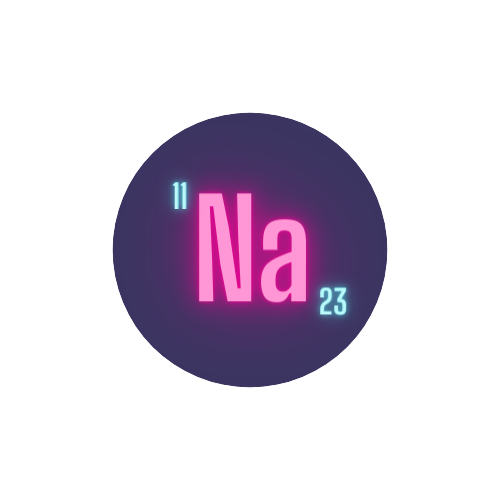

<p align="center">
  <a href="https://github.com/sohamsshah/sodium-ui" rel="noopener" target="_blank"></a></p>
</p>

<h1 align="center"><b>Sodium UI</b></h1>

<div align="center">

Swiftly develop elegant [React](https://reactjs.org/) apps. **Sodium** is a simple, modular and customizable web component library to build beautiful and accessible UI pieces for your React needs.

<!-- [](https://github.com/sohamsshah/sodium-ui/blob/master/LICENSE) -->

</div>

---


## **Installation** 📥

Sodium-UI is available as an [npm package](https://www.npmjs.com/package/sodium-ui).

```sh
npm i sodium-ui
```

## **Usage** 💻

```jsx
import * as React from 'react';
import ReactDOM from 'react-dom';
import Button from 'sodium-ui';

function App() {
  return <Button variant="primary">Hello World</Button>;
}

ReactDOM.render(<App />, document.querySelector('#app'));
```

## **License** 📜

This project is licensed under the terms of the
[MIT license](/LICENSE).


